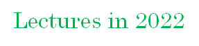
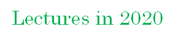

# **Lectures**

### [강사 소개](./Instructor_Introduction.md)

### 2022.10.24~2022.11.11 기업멤버십 SW캠프-빅데이터전문가 양성과정 
  - 고객사: 정보통신기획평가원(IITP) / 사단법인 디엠씨코넷 
  - 주제: 파이썬을 이용한 딥러닝(80시간) / 파이썬을 이용한 자연어처리(40시간)
  - 강의시간: 주중 전일(8시간/일), 총 120시간
  
### [2022.08.22~2022.09.05 인공지능 고급(시각)과정(대구)](./2022/20220822_CV.md) 
  - 고객사: 한국IT비즈니스 진흥협회 / 동북권ICT이노베이션스퀘어(대구경북강원)
  - 주제: 실시간 Style Transfer 애플리케이션 개발
  - 강의시간: 주중 저녁(4시간/일), 총 44시간

### 2022.08.08~2022.08.12 인공지능 고급(시각)과정(대구) 
  - 고객사: 한국IT비즈니스 진흥협회 / 동북권ICT이노베이션스퀘어(대구경북강원)  
  - 주제: 고급 시각처리
  - 강의시간: 주중 저녁(4시간/일), 총 20시간
  
### 2022.07.28~2022.09.08 인공지능 고급(언어)과정(경북) 
  - 고객사: 한국IT비즈니스 진흥협회 / 동북권ICT이노베이션스퀘어(대구경북강원)
  - 주제: 고급 자연어처리
  - 강의시간: 주중 오전(4시간/일), 총 120시간

### 2022.04.25~2022.06.22 인공지능 고급(언어)과정 
  - 고객사: 한국IT비즈니스 진흥협회 / 서울ICT이노베이션스퀘어
  - 주제: 고급 자연어처리
  - 강의시간: 주중 저녁(4시간/일), 총 160시간

### 2022.01.17~2022.01.20 혁신성장 청년인재 양성-빅데이터전문가 양성과정 
  - 고객사: 정보통신기획평가원(IITP) / 메디치이앤에스(주)
  - 주제: 자연어 처리
  - 강의시간: 주중 전일(8시간/일), 총 32시간

  

### 2021.12.20~2021.12.23  AI 융합 IoT가전 산업현장기술인력 혁신역량강화(5회차) 
  - 고객사: 한국산업기술진흥원(KIAT) / (주)글로벌 소프트웨어 캠퍼스
  - 주제: Jetson Nano를 이용한 AI 기반 음성인식 기기제어
  - 강의시간: 주중 전일(7~8시간/일), 총 30시간

### 2021.12.13 AI윤리 특강(2회차) 
  - 고객사: 한국IT비즈니스 진흥협회 / 서울ICT이노베이션스퀘어
  - 주제: 기존 윤리와 IT윤리, 그리고 AI 윤리
  - 강의시간: 4시간

### 2021.12.06~2021.12.09 AI 융합 IoT가전 산업현장기술인력 혁신역량강화(4회차) 
  - 고객사: 한국산업기술진흥원(KIAT) / (주)글로벌 소프트웨어 캠퍼스
  - 주제: Jetson Nano를 이용한 AI 기반 음성인식 기기제어
  - 강의시간: 주중 전일(7~8시간/일), 총 30시간

### 2021.11.29~2021.12.02 AI 융합 IoT가전 산업현장기술인력 혁신역량강화(3회차) 
  - 고객사: 한국산업기술진흥원(KIAT) / (주)글로벌 소프트웨어 캠퍼스
  - 주제: Jetson Nano를 이용한 AI 기반 음성인식 기기제어
  - 강의시간: 주중 전일(7~8시간/일), 총 30시간

### 2021.11.15~2021.11.19 AI 융합 IoT가전 산업현장기술인력 혁신역량강화(2회차) 
  - 고객사: 한국산업기술진흥원(KIAT) / (주)글로벌 소프트웨어 캠퍼스
  - 주제: Jetson Nano를 이용한 AI 기반 음성인식 기기제어
  - 강의시간: 주중 전일(7~8시간/일), 총 30시간

### 2021.11.11 AI윤리 특강(1회차) 
  - 고객사: 한국IT비즈니스 진흥협회 / 서울ICT이노베이션스퀘어
  - 주제: 기존 윤리와 IT윤리, 그리고 AI 윤리
  - 강의시간: 4시간

### 2021.10.19~2021.10.22 AI 융합 IoT가전 산업현장기술인력 혁신역량강화(1회차) 
  - 고객사: 한국산업기술진흥원(KIAT) / (주)글로벌 소프트웨어 캠퍼스
  - 주제: Jetson Nano를 이용한 AI 기반 음성인식 기기제어
  - 강의시간: 주중 전일(7~8시간/일), 총 30시간

### 2021.09.23, 2021.09.28 시흥시 소공인-미래전략경영대학 
  - 고객사: 시흥산업진흥원 / (주)에이블런
  - 주제: 스마트 공장의 개념과 구축 방안 및 관련 기술, 디지털 트랜스포메이션
  - 강의시간: 주중 오후~저녁(3시간/일), 총 6시간

### 2021.07.19~2021.09.02 선린인터넷고등학교 AI 중급 강의 
  - 고객사: 한국IT비즈니스 진흥협회 / 서울ICT이노베이션스퀘어
  - 주제: AI 중급
  - 강의시간: 주중 저녁(4시간/일), 총 160시간
   
### 2021.07.09 SK Hynix 신입사원 특강: 디지털 트랜스포메이션 
  - 고객사: (주) SK Hynix / (주)에이블런
  - 주제: 디지털 트랜스포메이션(반도체 산업에서 디지털 트랜스포메이션과 AI, 그리고 그 중요성)
  - 강의시간: 2시간

### 2021.04.07~2021.06.16 경기꿈의대학 2021년도 1학기 인공지능 강의 
  - 고객사: 경기도 교육청 / 경기꿈의대학
  - 주제: 수식없이 배우는 인공지능과 딥러닝
  - 강의시간: 매주 수요일 저녁(2~3시간/일), 총 17시간
  
  

### 2020.11.27~2020.11.28 2020 공개SW 대학생 체험캠프:한국교통대학교 
  - 고객사: 사단법인 한국공개소프트웨어협회(KOSSA)
  - 주제: 인공지능 / 딥러닝
  - 강의시간: 2020.11.27(토)~28(일) 전일(5시간), 총 10시간

### 2020.09.22~2020.12.24 경기꿈의대학 2020년도 2학기 인공지능 강의 
  - 고객사: 경기도 교육청 / 경기꿈의대학
  - 주제: 수식없이 배우는 인공지능과 딥러닝
  - 강의시간: 매주 화요일 저녁(2~3시간/일), 총 17시간
